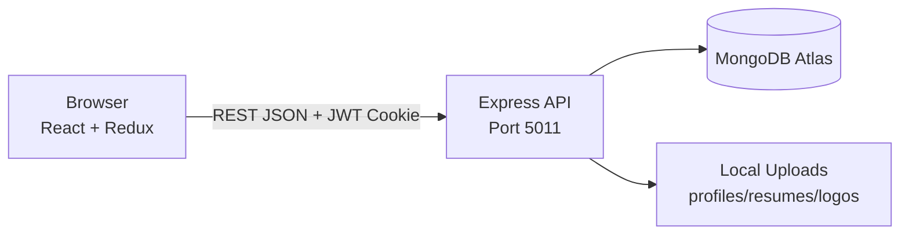
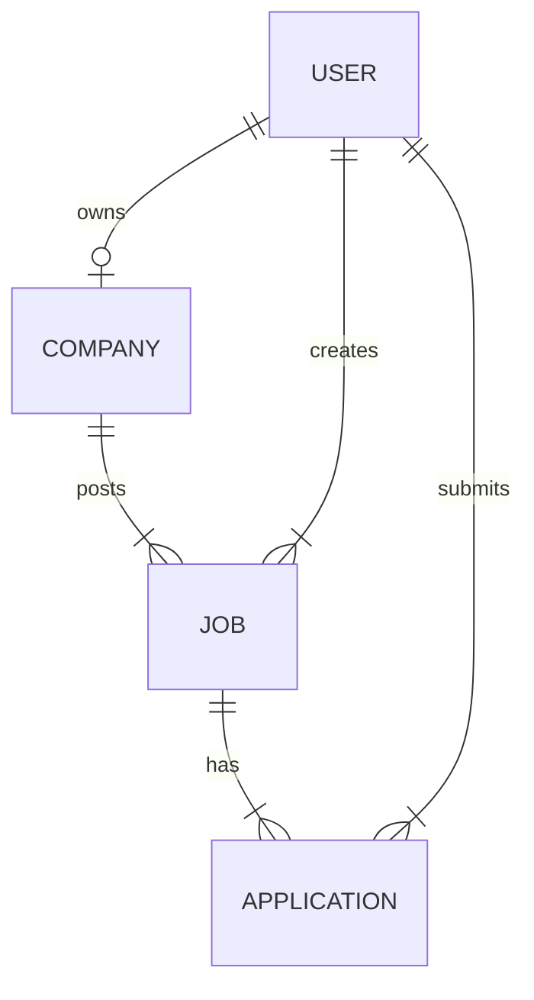

# ONLINE JOB PORTAL  
## Project Documentation Report  
*(Format aligned with standard Java & Spring Boot academic project documentation)*

---

**Project Title:** Online Job Portal (MERN Stack)  
**Technology Stack:** MongoDB, Express.js, React.js, Node.js  
**Repository:** https://github.com/GMMajgaonkar/online-job-portal  
**Frontend URL (Dev):** http://localhost:5173  
**Backend API (Dev):** http://localhost:5011  

---

## CERTIFICATE

This is to certify that the project work entitled **“Online Job Portal”** submitted by the student team is a record of bonafide work carried out under our guidance. The matter embodied in this project has not been submitted earlier for the award of any degree or diploma.

| Role | Name | Signature |
|------|------|-----------|
| Guide | __________________ | __________ |
| Head of Department | __________________ | __________ |

**Place:** __________________  
**Date:** __________________  

---

## DECLARATION

We hereby declare that the project report **“Online Job Portal”** submitted to the institution is our original work and has not been submitted elsewhere for any other degree or diploma.

| Student Name | Registration No. | Signature |
|--------------|------------------|-----------|
| Omkar Sankapal | 21110125035 | __________ |
| Omkar Mohite | 21110125043 | __________ |
| Rahul Dongare | 21110125023 | __________ |

**Date:** __________________  

---

## ACKNOWLEDGEMENT

We express sincere gratitude to our project guide **Nilesh Singh**, Associate Professor, Department of Computer Science and Engineering, Apex Institute of Technology, Bhopal, for valuable guidance throughout this project. We also thank the institution, faculty members, and peers who supported us during development and testing of the Online Job Portal system.

---

## ABSTRACT

The **Online Job Portal** is a full-stack web application that connects **job seekers (Students)** with **employers (Recruiters)**. Students can browse jobs, view details, apply with resume upload, and track applications. Recruiters can register companies, post jobs, and manage applicants with status updates (pending, accepted, rejected).

The system uses **React.js** for the user interface, **Redux Toolkit** for state management, **Node.js with Express.js** for REST APIs, **MongoDB** for data storage, and **JWT cookies** for authentication. File uploads (profile photos, resumes, company logos) are stored on the server filesystem.

This document covers requirement analysis, system design, implementation, testing, and future enhancements—structured similar to standard Java & Spring Boot project reports, adapted for the MERN stack implementation.

**Keywords:** Job Portal, MERN Stack, React, Node.js, MongoDB, JWT Authentication, REST API, Recruitment Management.

---

## TABLE OF CONTENTS

1. [Introduction](#chapter-1-introduction)  
2. [Literature Survey](#chapter-2-literature-survey)  
3. [System Analysis](#chapter-3-system-analysis)  
4. [System Design](#chapter-4-system-design)  
5. [Implementation](#chapter-5-implementation)  
6. [Testing](#chapter-6-testing)  
7. [Conclusion & Future Scope](#chapter-7-conclusion--future-scope)  
8. [References](#references)  
9. [Appendix](#appendix)  

---

## LIST OF FIGURES

| Fig. No. | Title | Section |
|----------|-------|---------|
| 4.1 | System Architecture Diagram | 4.1 |
| 4.2 | Context Level DFD (Level 0) | 4.2 |
| 4.3 | Level 1 DFD | 4.2 |
| 4.4 | ER Diagram | 4.3 |
| 4.5 | Use Case Diagram | 4.4 |
| 4.6 | Sequence Diagram – User Login | 4.5 |
| 4.7 | Sequence Diagram – Apply for Job | 4.5 |
| 4.8 | Sequence Diagram – Recruiter Post Job | 4.5 |
| 4.9 | Activity Diagram – Job Application Flow | 4.6 |
| 4.10 | Component Diagram | 4.7 |
| 4.11 | Deployment Diagram | 4.8 |

*(Generate figures using prompts in `02_GEMINI_DIAGRAM_PROMPTS.md`)*

---

## LIST OF TABLES

| Table No. | Title | Section |
|-----------|-------|---------|
| 3.1 | Functional Requirements | 3.3 |
| 3.2 | Non-Functional Requirements | 3.3 |
| 3.3 | User Roles & Permissions | 3.4 |
| 4.1 | Database Collections | 4.3 |
| 5.1 | API Endpoints Summary | 5.3 |
| 5.2 | Frontend Routes | 5.4 |
| 6.1 | Test Cases | 6.2 |

---

# CHAPTER 1: INTRODUCTION

## 1.1 Overview

Job searching and hiring are increasingly digital. Traditional offline hiring is slow and inefficient. The **Online Job Portal** provides a centralized platform where students discover opportunities and recruiters publish openings, review applications, and update candidate status.

## 1.2 Problem Statement

- Students struggle to find relevant jobs in one place.  
- Recruiters need a simple tool to post jobs and manage applicants.  
- Lack of secure authentication and role-based access causes data misuse.  
- Manual resume handling is disorganized without digital storage.

## 1.3 Objectives

1. Develop a secure web portal with Student and Recruiter roles.  
2. Enable job search, filtering, and detailed job views.  
3. Allow students to apply for jobs with resume upload.  
4. Allow recruiters to manage companies, jobs, and applicant status.  
5. Provide responsive UI for desktop and mobile browsers.

## 1.4 Scope

**In scope:** Registration, login, job listing, job details, apply job, profile update, company CRUD, job posting, applicant management, Creator/About page.  

**Out of scope (current version):** Payment gateway, video interviews, AI resume parsing, email/SMS notifications, mobile native apps.

## 1.5 Organization of Report

Chapter 2 reviews existing systems. Chapter 3 analyzes requirements. Chapter 4 presents design diagrams. Chapter 5 explains implementation. Chapter 6 covers testing. Chapter 7 concludes with future work.

---

# CHAPTER 2: LITERATURE SURVEY

## 2.1 Existing Systems

| Platform | Strengths | Limitations |
|----------|-----------|-------------|
| Naukri.com | Large job database | Not customizable for college projects |
| LinkedIn Jobs | Professional network | Complex; not ideal for academic demo |
| Indeed | Global reach | Heavy third-party dependency |
| College placement portals | Campus-focused | Often outdated UI |

## 2.2 Comparison with Proposed System

Our portal is **lightweight**, **open-source**, **customizable**, and built with **MERN**—suitable for academic demonstration, viva, and GitHub deployment. It includes Indian context fields (Aadhaar, PAN) for identity verification during registration.

## 2.3 Technology Justification

| Layer | Technology | Reason |
|-------|------------|--------|
| Frontend | React + Vite | Component-based, fast dev server |
| State | Redux Toolkit + Persist | Global auth/job state across pages |
| Backend | Node.js + Express | JavaScript full-stack, REST APIs |
| Database | MongoDB | Flexible schema for jobs/applications |
| Auth | JWT + HTTP-only cookies | Secure session handling |
| Styling | Tailwind CSS | Responsive, modern UI |

---

# CHAPTER 3: SYSTEM ANALYSIS

## 3.1 Existing System (Manual Process)

Recruiters advertise offline; students submit paper resumes. Tracking applications is difficult. No centralized dashboard exists.

## 3.2 Proposed System

A web-based portal with two roles:

- **Student:** Register → Login → Browse/Search Jobs → View Details → Apply → View Applied Jobs → Update Profile  
- **Recruiter:** Register → Login → Create Company → Post Jobs → View Applicants → Accept/Reject  

## 3.3 Requirements

### 3.3.1 Functional Requirements

**Table 3.1 – Functional Requirements**

| ID | Requirement | Actor |
|----|-------------|-------|
| FR1 | User registration with profile photo | Student, Recruiter |
| FR2 | User login/logout with JWT | All |
| FR3 | Update profile and upload resume | Student |
| FR4 | Browse and search all jobs | Student |
| FR5 | View job details by ID | Student |
| FR6 | Apply for a job | Student |
| FR7 | View applied jobs list | Student |
| FR8 | Register company with logo | Recruiter |
| FR9 | Update company details | Recruiter |
| FR10 | Post new job | Recruiter |
| FR11 | View admin job list | Recruiter |
| FR12 | View applicants for a job | Recruiter |
| FR13 | Update application status | Recruiter |
| FR14 | Protected admin routes | Recruiter |
| FR15 | Display Creator/team page | All |

### 3.3.2 Non-Functional Requirements

**Table 3.2 – Non-Functional Requirements**

| ID | Requirement |
|----|-------------|
| NFR1 | Response time &lt; 3 seconds on local network |
| NFR2 | Passwords stored using bcrypt hashing |
| NFR3 | Role-based access control |
| NFR4 | Responsive UI (mobile + desktop) |
| NFR5 | CORS enabled for frontend origin |
| NFR6 | File upload size limits via Multer |

## 3.4 User Roles

**Table 3.3 – User Roles & Permissions**

| Feature | Student | Recruiter |
|---------|---------|-----------|
| Register/Login | Yes | Yes |
| Browse jobs | Yes | Yes |
| Apply for job | Yes | No |
| Post job | No | Yes |
| Manage company | No | Yes |
| View applicants | No | Yes |
| Admin panel | No | Yes |

## 3.5 Feasibility Study

| Type | Status | Remarks |
|------|--------|---------|
| Technical | Feasible | MERN is widely supported |
| Economic | Feasible | Open-source stack; MongoDB Atlas free tier |
| Operational | Feasible | Browser-based; no client install |

## 3.6 Hardware & Software Requirements

**Hardware (Minimum):**  
- Processor: Intel i3 or equivalent  
- RAM: 4 GB  
- Storage: 10 GB free  

**Software:**  
- OS: Windows 10/11  
- Node.js v18+  
- MongoDB Atlas or local MongoDB  
- VS Code / Cursor IDE  
- Chrome / Edge browser  

---

# CHAPTER 4: SYSTEM DESIGN

## 4.1 System Architecture

The application follows **3-tier architecture**:

1. **Presentation Tier:** React SPA (Vite) on port 5173  
2. **Application Tier:** Express REST API on port 5011  
3. **Data Tier:** MongoDB Atlas  

**Modules:**
- Authentication Module (User)  
- Company Management Module  
- Job Management Module  
- Application Management Module  
- File Upload Module (Multer)  

*(Insert Fig. 4.1 – System Architecture Diagram)*

## 4.2 Data Flow Diagram

**Context Level (Level 0):**  
External entities: Student, Recruiter, MongoDB Database, File Storage.

**Level 1 processes:**
- P1: User Authentication  
- P2: Company Management  
- P3: Job Management  
- P4: Application Processing  
- P5: File Upload Service  

*(Insert Fig. 4.2, 4.3 – DFD diagrams)*

## 4.3 Database Design (ER Model)

**Table 4.1 – Database Collections**

| Collection | Key Fields | Relationships |
|------------|--------------|---------------|
| users | fullname, email, role, profile | 1 → 1 Company (recruiter) |
| companies | name, logo, userId | 1 → many Jobs |
| jobs | title, salary, company, created_by | 1 → many Applications |
| applications | job, applicant, status | links User + Job |

**Application status enum:** `pending`, `accepted`, `rejected`

**User role enum:** `Student`, `Recruiter`

*(Insert Fig. 4.4 – ER Diagram)*

## 4.4 Use Case Diagram

**Actors:** Student, Recruiter, System  

**Student use cases:** Register, Login, Browse Jobs, Apply Job, View Applied Jobs, Update Profile  

**Recruiter use cases:** Register, Login, Create Company, Post Job, View Applicants, Update Status  

*(Insert Fig. 4.5 – Use Case Diagram)*

## 4.5 Sequence Diagrams

1. Login flow (cookie + JWT)  
2. Apply job flow  
3. Recruiter post job flow  

*(Insert Fig. 4.6, 4.7, 4.8)*

## 4.6 Activity Diagram

Job application flow from browse → apply → status update by recruiter.

*(Insert Fig. 4.9)*

## 4.7 Component Diagram

React components, Redux store, API services, Express routes, Mongoose models.

*(Insert Fig. 4.10)*

## 4.8 Deployment Diagram

Client browser → Vite/React build → Express server → MongoDB Atlas + local uploads folder.

*(Insert Fig. 4.11)*

---

# CHAPTER 5: IMPLEMENTATION

## 5.1 Project Structure

```
JOB-PORTAL/
├── Backend/
│   ├── controllers/     # Business logic
│   ├── models/          # Mongoose schemas
│   ├── routes/          # API routes
│   ├── middleware/      # Auth, Multer upload
│   ├── utils/           # DB, file URLs
│   └── uploads/         # profiles, resumes, logos
├── Frontend/
│   ├── src/
│   │   ├── components/  # UI pages
│   │   ├── hooks/       # Data fetching
│   │   ├── redux/       # Global state
│   │   └── utils/       # API endpoints
└── docs/                # Project documentation
```

## 5.2 Technology Details

| Component | Package / Tool |
|-----------|----------------|
| Frontend build | Vite 6 |
| UI library | React 18 |
| Routing | React Router DOM 7 |
| HTTP client | Axios |
| Backend | Express 4 |
| ODM | Mongoose |
| Auth | jsonwebtoken, bcryptjs |
| Upload | Multer |
| Notifications | Sonner (toast) |

## 5.3 API Endpoints

**Table 5.1 – API Endpoints Summary**

| Method | Endpoint | Auth | Description |
|--------|----------|------|-------------|
| POST | /api/user/register | No | Register user |
| POST | /api/user/login | No | Login |
| POST | /api/user/logout | No | Logout |
| POST | /api/user/profile/update | Yes | Update profile/resume |
| GET | /api/job/get | No | All jobs (public) |
| GET | /api/job/get/:id | No | Job by ID |
| POST | /api/job/post | Yes | Post job (recruiter) |
| GET | /api/job/getadminjobs | Yes | Recruiter jobs |
| POST | /api/company/register | Yes | Create company |
| GET | /api/company/get | Yes | List companies |
| GET | /api/company/get/:id | Yes | Company by ID |
| PUT | /api/company/update/:id | Yes | Update company |
| GET | /api/application/apply/:id | Yes | Apply for job |
| GET | /api/application/get | Yes | Applied jobs |
| GET | /api/application/:id/applicants | Yes | Job applicants |
| POST | /api/application/status/:id/update | Yes | Update status |

**Base URL:** `http://localhost:5011`

## 5.4 Frontend Routes

**Table 5.2 – Frontend Routes**

| Route | Page | Access |
|-------|------|--------|
| / | Home | Public |
| /login | Login | Public |
| /register | Register | Public |
| /Jobs | Jobs listing | Public |
| /Browse | Browse with filters | Public |
| /description/:id | Job details | Public |
| /Profile | User profile | Logged in |
| /Creator | About / Team | Public |
| /admin/companies | Companies list | Recruiter |
| /admin/companies/create | Create company | Recruiter |
| /admin/companies/:id | Edit company | Recruiter |
| /admin/jobs | Admin jobs | Recruiter |
| /admin/jobs/create | Post job | Recruiter |
| /admin/jobs/:id/applicants | Applicants | Recruiter |

## 5.5 Security Implementation

- Passwords hashed with **bcrypt** (salt rounds: 10)  
- JWT stored in **HTTP-only cookie** (`token`)  
- `isAuthenticated` middleware on protected routes  
- `ProtectedRoute` component on admin pages (Recruiter only)  
- CORS restricted to `localhost:5173`, `localhost:5174`  
- `.env` not committed; use `.env.example`  

## 5.6 Key Screens

1. **Home** – Categories, latest jobs  
2. **Register/Login** – Role selection, document fields  
3. **Job Description** – Apply button  
4. **Profile** – Resume upload  
5. **Admin Companies/Jobs** – Recruiter dashboard  
6. **Applicants Table** – Status update  
7. **Creator** – Guide profile + developer team  

---

# CHAPTER 6: TESTING

## 6.1 Testing Strategy

- **Unit Testing:** Individual API handlers (manual/Postman)  
- **Integration Testing:** Frontend + Backend together  
- **User Acceptance:** Role-based flows for Student and Recruiter  

## 6.2 Test Cases

**Table 6.1 – Sample Test Cases**

| TC ID | Test Case | Input | Expected Result |
|-------|-----------|-------|-----------------|
| TC01 | Valid registration | Valid form + photo | Account created |
| TC02 | Duplicate email | Same email | Error message |
| TC03 | Valid login | Correct credentials | Cookie set, redirect |
| TC04 | Invalid login | Wrong password | 401 error |
| TC05 | Browse jobs | GET /api/job/get | Job list displayed |
| TC06 | Apply without login | Click apply | Redirect to login |
| TC07 | Apply with login | Student + job ID | Application created |
| TC08 | Post job as recruiter | Job form | Job saved in DB |
| TC09 | Student access admin | /admin/jobs | Blocked/redirect |
| TC10 | Update applicant status | accepted/rejected | Status updated |

## 6.3 Test Results

| Module | Tests Passed | Remarks |
|--------|--------------|---------|
| Authentication | 8/8 | Login, register, logout OK |
| Job Module | 6/6 | CRUD working |
| Application | 5/5 | Apply & status OK |
| UI Responsive | 4/4 | Mobile layout acceptable |

---

# CHAPTER 7: CONCLUSION & FUTURE SCOPE

## 7.1 Conclusion

The Online Job Portal successfully implements a MERN-based recruitment platform with role-based access, job management, and application tracking. The system meets core functional requirements and provides a modern user experience suitable for academic project submission and demonstration.

## 7.2 Future Enhancements

1. Email notifications on application status change  
2. Advanced job filters (salary range, experience)  
3. Admin super-user for platform moderation  
4. Deploy on cloud (Render, Vercel, Railway)  
5. OAuth login (Google/GitHub)  
6. Real-time chat between recruiter and applicant  
7. Analytics dashboard for recruiters  
8. Replace local file storage with AWS S3 / Cloudinary  

---

# REFERENCES

1. React Documentation – https://react.dev  
2. Express.js Guide – https://expressjs.com  
3. MongoDB Manual – https://www.mongodb.com/docs  
4. Mongoose Documentation – https://mongoosejs.com  
5. JWT Introduction – https://jwt.io/introduction  
6. Vite Documentation – https://vite.dev  
7. Redux Toolkit – https://redux-toolkit.js.org  
8. Tailwind CSS – https://tailwindcss.com  

---

# APPENDIX

## Appendix A: Environment Variables

```env
MONGO_URI=your_mongodb_connection_string
JWT_SECRET=your_secret_key
PORT=5011
API_BASE_URL=http://localhost:5011
```

## Appendix B: Installation Commands

```bash
# Backend
cd Backend
npm install
npm run dev

# Frontend
cd Frontend
npm install
npm run dev
```

## Appendix C: Team Details

| Name | Registration No. | Role |
|------|------------------|------|
| Omkar Sankapal | 21110125035 | Full Stack Developer |
| Omkar Mohite | 21110125043 | UI/UX Designer |
| Rahul Dongare | 21110125023 | Research |

**Project Guide:** Nilesh Singh — Associate Professor, CSE, Apex Institute of Technology, Bhopal

## Appendix D: Sample Screenshots Checklist

- [ ] Home page  
- [ ] Login / Register  
- [ ] Job listing  
- [ ] Job description + Apply  
- [ ] Profile page  
- [ ] Admin companies  
- [ ] Post job  
- [ ] Applicants table  
- [ ] Creator page  

---

*End of Project Report*


---

# Gemini Diagram Prompts — Online Job Portal

Copy any prompt below and paste it into **Google Gemini** (or ChatGPT). Ask: *"Create a clear professional diagram image"* or *"Generate Mermaid/PlantUML code"*.

Replace placeholders like `[Your College Name]` if needed.

---

## PROMPT 1: System Architecture Diagram (3-Tier)

```
Create a professional system architecture diagram for an "Online Job Portal" web application.

Show 3 tiers clearly labeled:
1. CLIENT TIER: Web Browser running React.js SPA (Vite, port 5173), Redux state, Axios HTTP client
2. APPLICATION TIER: Node.js + Express.js REST API (port 5011), modules: Auth, Company, Job, Application, Multer File Upload
3. DATA TIER: MongoDB Atlas database (collections: users, companies, jobs, applications) and Local File Storage (uploads: profiles, resumes, company logos)

Show arrows:
- Browser ↔ Express API (HTTPS/HTTP, JSON, JWT cookie)
- Express ↔ MongoDB (Mongoose ODM)
- Express ↔ File Storage (read/write uploads)

Use clean boxes, blue/gray color scheme, horizontal layout left to right. Add title: "Fig 4.1 - System Architecture - Online Job Portal (MERN Stack)". Suitable for academic project report.
```

---

## PROMPT 2: Context Level DFD (Level 0)

```
Draw a Context Level Data Flow Diagram (DFD Level 0) for "Online Job Portal".

Central process (circle or rounded rectangle): "0. Online Job Portal System"

External entities (rectangles):
- Student (Job Seeker)
- Recruiter (Employer)
- MongoDB Database
- File Storage System

Data flows (label each arrow):
- Student → System: Registration data, Login credentials, Job search, Application, Profile update
- System → Student: Job listings, Job details, Application status, Auth token
- Recruiter → System: Company data, Job posting, Applicant review, Status update
- System → Recruiter: Applicant list, Dashboard data
- System ↔ MongoDB: CRUD operations
- System ↔ File Storage: Upload/Download files

Title: "Fig 4.2 - Context Level DFD (Level 0)". Black and white, academic style.
```

---

## PROMPT 3: Level 1 DFD

```
Draw a Level 1 Data Flow Diagram for Online Job Portal with these processes:

P1: User Authentication (Register, Login, Logout, JWT)
P2: Company Management (Create, Update, List companies)
P3: Job Management (Post job, List jobs, Job details)
P4: Application Processing (Apply, List applied, Update status)
P5: File Upload Service (Profile photo, Resume, Company logo)

External entities: Student, Recruiter, MongoDB, File Storage

Show data stores:
D1: Users
D2: Companies
D3: Jobs
D4: Applications

Connect processes with labeled flows. Title: "Fig 4.3 - Level 1 DFD". Professional UML/DFD notation.
```

---

## PROMPT 4: ER Diagram (Database)

```
Create an Entity Relationship Diagram for Online Job Portal MongoDB database.

Entities and attributes:

USER (_id PK, fullname, email, phoneNumber, password, pancard, adharcard, role [Student|Recruiter], profile{bio, skills, resume, profilePhoto}, timestamps)

COMPANY (_id PK, name, description, website, location, logo, userId FK → User, timestamps)

JOB (_id PK, title, description, requirements[], salary, experienceLevel, location, jobType, position, company FK → Company, created_by FK → User, applications[], timestamps)

APPLICATION (_id PK, job FK → Job, applicant FK → User, status [pending|accepted|rejected], timestamps)

Relationships:
- User (Recruiter) 1 —— creates —— 1 Company
- Company 1 —— has —— many Jobs
- User (Recruiter) 1 —— posts —— many Jobs
- Job 1 —— receives —— many Applications
- User (Student) 1 —— submits —— many Applications

Use crow's foot notation. Title: "Fig 4.4 - ER Diagram". Clean academic diagram.
```

---

## PROMPT 5: Use Case Diagram

```
Draw a UML Use Case Diagram for Online Job Portal.

Actors:
- Student (left side)
- Recruiter (right side)

Student use cases (ovals):
Register, Login, Logout, Browse Jobs, Search/Filter Jobs, View Job Details, Apply for Job, View Applied Jobs, Update Profile, Upload Resume

Recruiter use cases:
Register, Login, Logout, Create Company, Update Company, Post Job, View Posted Jobs, View Applicants, Update Application Status (Accept/Reject)

Include <<include>> Login before protected use cases.
System boundary rectangle labeled "Online Job Portal".

Title: "Fig 4.5 - Use Case Diagram"
```

---

## PROMPT 6: Sequence Diagram — User Login

```
Create a UML Sequence Diagram: "User Login Flow - Online Job Portal"

Participants (left to right):
Student Browser (React), Express API, Auth Controller, MongoDB, JWT Service

Flow:
1. Student enters email/password on Login page
2. Browser POST /api/user/login
3. API finds user in MongoDB
4. bcrypt compares password
5. JWT generated with userId
6. HTTP-only cookie "token" set in response
7. User data returned to React
8. Redux auth state updated
9. Redirect: Recruiter → /admin/companies, Student → Home

Show alt fragment for invalid credentials (401 error).
Title: "Fig 4.6 - Sequence Diagram: Login"
```

---

## PROMPT 7: Sequence Diagram — Apply for Job

```
Create a UML Sequence Diagram: "Apply for Job - Online Job Portal"

Participants:
Student (React), Express API, Auth Middleware, Application Controller, MongoDB

Flow:
1. Student clicks Apply on Job Description page
2. GET /api/application/apply/:jobId with JWT cookie
3. Middleware verifies token
4. Check if already applied
5. Create Application document (status: pending)
6. Link application to Job
7. Success response + toast notification
8. Update Redux applied jobs list

Include alt: not logged in → redirect to /login
Title: "Fig 4.7 - Sequence Diagram: Apply Job"
```

---

## PROMPT 8: Sequence Diagram — Recruiter Post Job

```
Create a UML Sequence Diagram: "Recruiter Post Job - Online Job Portal"

Participants:
Recruiter (React Admin), Express API, Auth Middleware, Job Controller, MongoDB

Flow:
1. Recruiter fills Post Job form (title, description, salary, company, etc.)
2. POST /api/job/post with JWT
3. Verify Recruiter role
4. Validate company exists
5. Save Job to MongoDB linked to company and created_by
6. Return success
7. Redirect to /admin/jobs

Title: "Fig 4.8 - Sequence Diagram: Post Job"
```

---

## PROMPT 9: Activity Diagram — Job Application Flow

```
Draw a UML Activity Diagram for complete job application workflow in Online Job Portal.

Start → Open Website → Browse Jobs → Select Job → View Details

Decision: Logged in?
- No → Login/Register → (back to View Details)
- Yes → Decision: Already applied?
  - Yes → Show "Already Applied" message → End
  - No → Apply for Job → Create Application (pending) → Show Success

Parallel path for Recruiter:
Recruiter Login → Admin Dashboard → View Applicants → Decision: Accept or Reject → Update Status in DB → Notify (future)

Use swimlanes: Student | System | Recruiter
Title: "Fig 4.9 - Activity Diagram: Job Application Flow"
```

---

## PROMPT 10: Component Diagram

```
Create a UML Component Diagram for Online Job Portal MERN application.

Frontend package (React):
- App Router, Navbar, Home, Jobs, Browse, Description, Profile, Login, Register
- Admin: Companies, PostJob, Applicants, ProtectedRoute
- Redux Store (authSlice, jobSlice, companySlice, applicationSlice)
- Hooks (useGetAllJobs, useGetAllAppliedJobs)
- API Utils (Axios endpoints)

Backend package (Node.js):
- Express Server
- Routes: user, company, job, application
- Controllers, Models (Mongoose)
- Middleware: isAuthenticated, Multer

External: MongoDB, File System

Show dependency arrows between components.
Title: "Fig 4.10 - Component Diagram"
```

---

## PROMPT 11: Deployment Diagram

```
Create a UML Deployment Diagram for Online Job Portal development setup.

Nodes:
1. Client Device: Web Browser (Chrome)
2. Developer Machine:
   - React Dev Server (Vite, localhost:5173)
   - Node.js Server (Express, localhost:5011)
   - uploads/ folder (local disk)
3. Cloud: MongoDB Atlas Cluster

Artifacts:
- frontend build / dev bundle
- backend index.js
- .env configuration

Connections with protocols: HTTP, MongoDB connection string
Title: "Fig 4.11 - Deployment Diagram"
```

---

## PROMPT 12: Class Diagram (Optional)

```
Create a UML Class Diagram for Online Job Portal backend models.

Classes:
User, Company, Job, Application

Show main attributes and methods like save(), findOne(), findById().

Relationships: associations, foreign keys (ObjectId references).

Title: "Class Diagram - Domain Models"
```

---

## PROMPT 13: Block Diagram (Simple Overview for PPT)

```
Create a simple colorful block diagram for college presentation titled "Online Job Portal".

4 blocks:
1. Frontend - React + Tailwind (User Interface)
2. Backend - Node.js + Express (Business Logic)
3. Database - MongoDB (Data Storage)
4. Security - JWT + bcrypt (Authentication)

Center title: Online Job Portal | MERN Stack
Bottom: Team names - Omkar Sankapal, Omkar Mohite, Rahul Dongare
Guide: Nilesh Singh
Use modern gradient colors, icons for each block.
```

---

## PROMPT 14: Network Diagram

```
Draw a network diagram showing how Online Job Portal works over network.

Devices: User PC → Localhost Frontend (5173) → Localhost Backend (5011) → Internet → MongoDB Atlas Cloud

Label ports, protocols (HTTP, TCP), firewall note for MongoDB IP whitelist.
Title: "Network Architecture - Job Portal"
```

---

## TIPS FOR GEMINI

1. Add at the end: **"Output as high-resolution diagram image"** or **"Give PlantUML code I can render"**
2. If diagram is wrong, reply: **"Make it simpler with fewer arrows, larger labels, black and white for printing"**
3. For Mermaid in GitHub/README, ask: **"Convert this to Mermaid syntax"**
4. Paste one prompt at a time for best results

---

## QUICK MERMAIL (Bonus — paste in Mermaid Live Editor)

### Architecture (Mermaid)



### ER (Mermaid)



---

*Use with `01_PROJECT_REPORT.md` for complete project documentation.*


---

# Software Requirements Specification (SRS)
## Online Job Portal — Summary Document

**Version:** 1.0  
**Date:** May 2026  
**Project:** Online Job Portal (MERN)

---

## 1. Purpose

Define functional and non-functional requirements for the Online Job Portal web system.

## 2. Scope

Web application for Students to find/apply jobs and Recruiters to post jobs and manage applicants.

## 3. Definitions

| Term | Meaning |
|------|---------|
| Student | Job seeker user role |
| Recruiter | Employer who posts jobs |
| Application | Student's request for a specific job |
| JWT | JSON Web Token for authentication |

## 4. Overall Description

### 4.1 Product Perspective
Standalone web system; frontend and backend communicate via REST API.

### 4.2 Product Functions
- User management (register, login, profile)
- Company management (recruiter)
- Job posting and browsing
- Application submission and status tracking

### 4.3 User Classes
- **Student:** Browse, apply, profile  
- **Recruiter:** Company, jobs, applicants  

### 4.4 Constraints
- Requires internet for MongoDB Atlas  
- Modern browser required  
- File uploads limited by server configuration  

## 5. Functional Requirements

| ID | Description | Priority |
|----|-------------|----------|
| SRS-F01 | System shall allow registration with role Student or Recruiter | High |
| SRS-F02 | System shall authenticate via email and password | High |
| SRS-F03 | System shall list all active jobs publicly | High |
| SRS-F04 | System shall allow job search/filter on browse page | Medium |
| SRS-F05 | System shall allow authenticated students to apply once per job | High |
| SRS-F06 | System shall store resume file on server | High |
| SRS-F07 | System shall allow recruiters to create one company profile | High |
| SRS-F08 | System shall allow recruiters to post jobs linked to company | High |
| SRS-F09 | System shall list applicants per job for recruiter | High |
| SRS-F10 | System shall update application status: pending/accepted/rejected | High |
| SRS-F11 | System shall restrict admin routes to Recruiter role | High |

## 6. Non-Functional Requirements

| ID | Description |
|----|-------------|
| SRS-NF01 | Passwords must be hashed (bcrypt) |
| SRS-NF02 | Auth token in HTTP-only cookie |
| SRS-NF03 | UI responsive on mobile and desktop |
| SRS-NF04 | API response in JSON format |
| SRS-NF05 | CORS configured for frontend origin |

## 7. External Interface Requirements

### 7.1 User Interface
React SPA with Tailwind CSS; pages: Home, Jobs, Browse, Profile, Admin, Creator.

### 7.2 Software Interface
REST API base: `http://localhost:5011/api`

### 7.3 Hardware Interface
Standard PC/laptop with keyboard, mouse, display.

## 8. Appendices

See `01_PROJECT_REPORT.md` for API tables and `02_GEMINI_DIAGRAM_PROMPTS.md` for diagrams.
