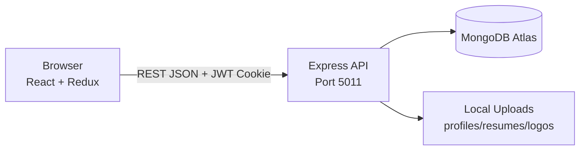
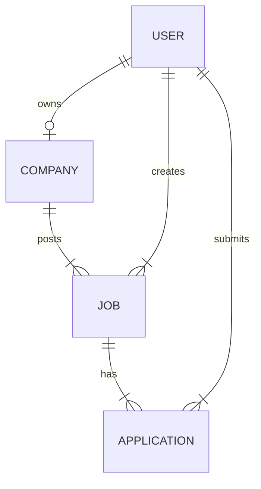

# Gemini Diagram Prompts — Online Job Portal

Copy any prompt below and paste it into **Google Gemini** (or ChatGPT). Ask: *"Create a clear professional diagram image"* or *"Generate Mermaid/PlantUML code"*.

Replace placeholders like `[Your College Name]` if needed.

---

## PROMPT 1: System Architecture Diagram (3-Tier)

```
Create a professional system architecture diagram for an "Online Job Portal" web application.

Show 3 tiers clearly labeled:
1. CLIENT TIER: Web Browser running React.js SPA (Vite, port 5173), Redux state, Axios HTTP client
2. APPLICATION TIER: Node.js + Express.js REST API (port 5011), modules: Auth, Company, Job, Application, Multer File Upload
3. DATA TIER: MongoDB Atlas database (collections: users, companies, jobs, applications) and Local File Storage (uploads: profiles, resumes, company logos)

Show arrows:
- Browser ↔ Express API (HTTPS/HTTP, JSON, JWT cookie)
- Express ↔ MongoDB (Mongoose ODM)
- Express ↔ File Storage (read/write uploads)

Use clean boxes, blue/gray color scheme, horizontal layout left to right. Add title: "Fig 4.1 - System Architecture - Online Job Portal (MERN Stack)". Suitable for academic project report.
```

---

## PROMPT 2: Context Level DFD (Level 0)

```
Draw a Context Level Data Flow Diagram (DFD Level 0) for "Online Job Portal".

Central process (circle or rounded rectangle): "0. Online Job Portal System"

External entities (rectangles):
- Student (Job Seeker)
- Recruiter (Employer)
- MongoDB Database
- File Storage System

Data flows (label each arrow):
- Student → System: Registration data, Login credentials, Job search, Application, Profile update
- System → Student: Job listings, Job details, Application status, Auth token
- Recruiter → System: Company data, Job posting, Applicant review, Status update
- System → Recruiter: Applicant list, Dashboard data
- System ↔ MongoDB: CRUD operations
- System ↔ File Storage: Upload/Download files

Title: "Fig 4.2 - Context Level DFD (Level 0)". Black and white, academic style.
```

---

## PROMPT 3: Level 1 DFD

```
Draw a Level 1 Data Flow Diagram for Online Job Portal with these processes:

P1: User Authentication (Register, Login, Logout, JWT)
P2: Company Management (Create, Update, List companies)
P3: Job Management (Post job, List jobs, Job details)
P4: Application Processing (Apply, List applied, Update status)
P5: File Upload Service (Profile photo, Resume, Company logo)

External entities: Student, Recruiter, MongoDB, File Storage

Show data stores:
D1: Users
D2: Companies
D3: Jobs
D4: Applications

Connect processes with labeled flows. Title: "Fig 4.3 - Level 1 DFD". Professional UML/DFD notation.
```

---

## PROMPT 4: ER Diagram (Database)

```
Create an Entity Relationship Diagram for Online Job Portal MongoDB database.

Entities and attributes:

USER (_id PK, fullname, email, phoneNumber, password, pancard, adharcard, role [Student|Recruiter], profile{bio, skills, resume, profilePhoto}, timestamps)

COMPANY (_id PK, name, description, website, location, logo, userId FK → User, timestamps)

JOB (_id PK, title, description, requirements[], salary, experienceLevel, location, jobType, position, company FK → Company, created_by FK → User, applications[], timestamps)

APPLICATION (_id PK, job FK → Job, applicant FK → User, status [pending|accepted|rejected], timestamps)

Relationships:
- User (Recruiter) 1 —— creates —— 1 Company
- Company 1 —— has —— many Jobs
- User (Recruiter) 1 —— posts —— many Jobs
- Job 1 —— receives —— many Applications
- User (Student) 1 —— submits —— many Applications

Use crow's foot notation. Title: "Fig 4.4 - ER Diagram". Clean academic diagram.
```

---

## PROMPT 5: Use Case Diagram

```
Draw a UML Use Case Diagram for Online Job Portal.

Actors:
- Student (left side)
- Recruiter (right side)

Student use cases (ovals):
Register, Login, Logout, Browse Jobs, Search/Filter Jobs, View Job Details, Apply for Job, View Applied Jobs, Update Profile, Upload Resume

Recruiter use cases:
Register, Login, Logout, Create Company, Update Company, Post Job, View Posted Jobs, View Applicants, Update Application Status (Accept/Reject)

Include <<include>> Login before protected use cases.
System boundary rectangle labeled "Online Job Portal".

Title: "Fig 4.5 - Use Case Diagram"
```

---

## PROMPT 6: Sequence Diagram — User Login

```
Create a UML Sequence Diagram: "User Login Flow - Online Job Portal"

Participants (left to right):
Student Browser (React), Express API, Auth Controller, MongoDB, JWT Service

Flow:
1. Student enters email/password on Login page
2. Browser POST /api/user/login
3. API finds user in MongoDB
4. bcrypt compares password
5. JWT generated with userId
6. HTTP-only cookie "token" set in response
7. User data returned to React
8. Redux auth state updated
9. Redirect: Recruiter → /admin/companies, Student → Home

Show alt fragment for invalid credentials (401 error).
Title: "Fig 4.6 - Sequence Diagram: Login"
```

---

## PROMPT 7: Sequence Diagram — Apply for Job

```
Create a UML Sequence Diagram: "Apply for Job - Online Job Portal"

Participants:
Student (React), Express API, Auth Middleware, Application Controller, MongoDB

Flow:
1. Student clicks Apply on Job Description page
2. GET /api/application/apply/:jobId with JWT cookie
3. Middleware verifies token
4. Check if already applied
5. Create Application document (status: pending)
6. Link application to Job
7. Success response + toast notification
8. Update Redux applied jobs list

Include alt: not logged in → redirect to /login
Title: "Fig 4.7 - Sequence Diagram: Apply Job"
```

---

## PROMPT 8: Sequence Diagram — Recruiter Post Job

```
Create a UML Sequence Diagram: "Recruiter Post Job - Online Job Portal"

Participants:
Recruiter (React Admin), Express API, Auth Middleware, Job Controller, MongoDB

Flow:
1. Recruiter fills Post Job form (title, description, salary, company, etc.)
2. POST /api/job/post with JWT
3. Verify Recruiter role
4. Validate company exists
5. Save Job to MongoDB linked to company and created_by
6. Return success
7. Redirect to /admin/jobs

Title: "Fig 4.8 - Sequence Diagram: Post Job"
```

---

## PROMPT 9: Activity Diagram — Job Application Flow

```
Draw a UML Activity Diagram for complete job application workflow in Online Job Portal.

Start → Open Website → Browse Jobs → Select Job → View Details

Decision: Logged in?
- No → Login/Register → (back to View Details)
- Yes → Decision: Already applied?
  - Yes → Show "Already Applied" message → End
  - No → Apply for Job → Create Application (pending) → Show Success

Parallel path for Recruiter:
Recruiter Login → Admin Dashboard → View Applicants → Decision: Accept or Reject → Update Status in DB → Notify (future)

Use swimlanes: Student | System | Recruiter
Title: "Fig 4.9 - Activity Diagram: Job Application Flow"
```

---

## PROMPT 10: Component Diagram

```
Create a UML Component Diagram for Online Job Portal MERN application.

Frontend package (React):
- App Router, Navbar, Home, Jobs, Browse, Description, Profile, Login, Register
- Admin: Companies, PostJob, Applicants, ProtectedRoute
- Redux Store (authSlice, jobSlice, companySlice, applicationSlice)
- Hooks (useGetAllJobs, useGetAllAppliedJobs)
- API Utils (Axios endpoints)

Backend package (Node.js):
- Express Server
- Routes: user, company, job, application
- Controllers, Models (Mongoose)
- Middleware: isAuthenticated, Multer

External: MongoDB, File System

Show dependency arrows between components.
Title: "Fig 4.10 - Component Diagram"
```

---

## PROMPT 11: Deployment Diagram

```
Create a UML Deployment Diagram for Online Job Portal development setup.

Nodes:
1. Client Device: Web Browser (Chrome)
2. Developer Machine:
   - React Dev Server (Vite, localhost:5173)
   - Node.js Server (Express, localhost:5011)
   - uploads/ folder (local disk)
3. Cloud: MongoDB Atlas Cluster

Artifacts:
- frontend build / dev bundle
- backend index.js
- .env configuration

Connections with protocols: HTTP, MongoDB connection string
Title: "Fig 4.11 - Deployment Diagram"
```

---

## PROMPT 12: Class Diagram (Optional)

```
Create a UML Class Diagram for Online Job Portal backend models.

Classes:
User, Company, Job, Application

Show main attributes and methods like save(), findOne(), findById().

Relationships: associations, foreign keys (ObjectId references).

Title: "Class Diagram - Domain Models"
```

---

## PROMPT 13: Block Diagram (Simple Overview for PPT)

```
Create a simple colorful block diagram for college presentation titled "Online Job Portal".

4 blocks:
1. Frontend - React + Tailwind (User Interface)
2. Backend - Node.js + Express (Business Logic)
3. Database - MongoDB (Data Storage)
4. Security - JWT + bcrypt (Authentication)

Center title: Online Job Portal | MERN Stack
Bottom: Team names - Omkar Sankapal, Omkar Mohite, Rahul Dongare
Guide: Nilesh Singh
Use modern gradient colors, icons for each block.
```

---

## PROMPT 14: Network Diagram

```
Draw a network diagram showing how Online Job Portal works over network.

Devices: User PC → Localhost Frontend (5173) → Localhost Backend (5011) → Internet → MongoDB Atlas Cloud

Label ports, protocols (HTTP, TCP), firewall note for MongoDB IP whitelist.
Title: "Network Architecture - Job Portal"
```

---

## TIPS FOR GEMINI

1. Add at the end: **"Output as high-resolution diagram image"** or **"Give PlantUML code I can render"**
2. If diagram is wrong, reply: **"Make it simpler with fewer arrows, larger labels, black and white for printing"**
3. For Mermaid in GitHub/README, ask: **"Convert this to Mermaid syntax"**
4. Paste one prompt at a time for best results

---

## QUICK MERMAIL (Bonus — paste in Mermaid Live Editor)

### Architecture (Mermaid)



### ER (Mermaid)



---

*Use with `01_PROJECT_REPORT.md` for complete project documentation.*
